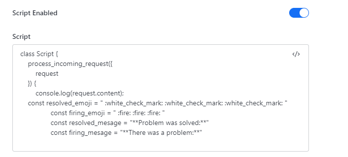
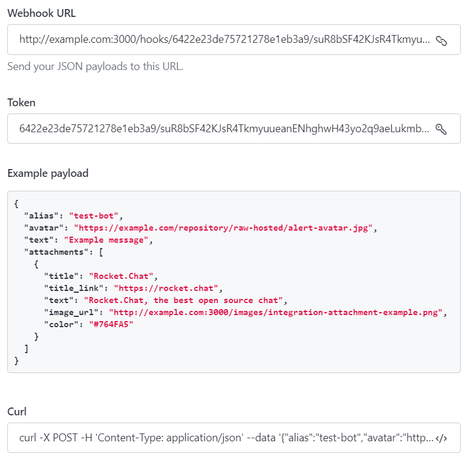
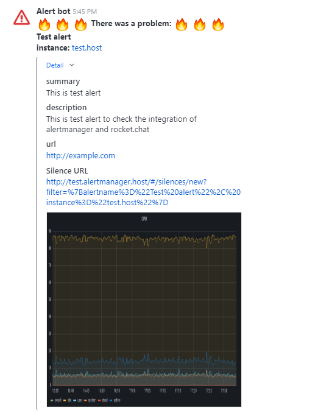

# Sending alerts to rocket.chat

Alertmanager does not provide sending alerts directly to rocketchat. But it can pass alerts via webhook. Rocket chat, in turn, can receive and process external webhooks.  
#### Links
[rocket.chat prometheus](https://docs.rocket.chat/use-rocket.chat/workspace-administration/integrations/prometheus)  
[rocket.chat integrations](https://docs.rocket.chat/use-rocket.chat/workspace-administration/integrations)
## Description of the script
You can see the script [here](IncomingWebHook.js).

The script takes a message from alertmanager as input and generates a response from it. The response structure looks like this:

```js
content: {
                "username": "Alert bot",
                "text": main_title +  "\n**" + alert.labels.alertname + "**\n" +
                       "**instance: **" + alert.labels.instance,
                "attachments": [{
                    "title_link": request.content.externalURL,
                    "collapsed": true,
                    "title": "Подробнее",
                    "fields": fields,
                    "image_url": alert.annotations.imageurl,
                }]
            }
```   
The response has 3 parameters:  
- **username** – Username displayed in the chat.  
- **text** – This is the message that will be sent to the chat. There is important information that should be immediately visible. By default, there is a title, an alert name and an instance. If necessary, you can add more fields to them or replace the current ones.   
- **attachments** – Additional information about alert.

### Headline of the message (main_title)  
The message header is formed at the very beginning of the script. The title is presented in the **text** parameter. It can be modified by changing the following parameters:  
- **resolved_message** - title text of the solved problem message.    
- **firing_message** - the title text of the problem message.   
For better display of headers there is **emoji** in the header. They can be modified or removed by changing the following parameters:   
- **resolved_emoji** - emoji that are added to the title of the message about the solution to the problem.
- **firing_emoji** - emoji that are added to the header of the message about the occurrence of the problem.  

### Message body
The message body is formed in the **return** section, in the **text** parameter. The main information about the alert is displayed in the body of the message, that is the name of the alert and the instance where it occurred.

It is important that alertmanager can group messages and send several messages at once. Since alertname and instance are included in the text of the message, it is necessary that the grouping takes place according to these values. Otherwise, the data from the main message will only match the data of the last alert in attachments. If a different grouping is needed, you can move instance to attachments.  

### attachments
Attachments parameter consists of several fields:  
- **collapsed** - controls whether attachments will be collapsed. It may be not very convenient, if long alerts come. Therefore, by default they are collapsed.  
- **title** – attachment header.  
- **image_url** – link to the image that will be displayed in alerts. Used to send a picture. The image address is taken from the alert, that allows you to send graphics in messages. If this parameter is not applied, rocket chat will simply not add a picture. As in the case of instance and alertname, if several alerts arrive at once, the picture will be added only from the last one.  
rocket.chat compresses the picture if it is too big. But it can be opened simply by clicking on it.  
<span style="color:red">WARNING:</span> rocket chat takes the picture at the moment when you open the message. If you use an image that is generated on demand, for example, through grafana-render, you need to pass it a static time frame.  
- **fields** – structure containing information about alerts.
The **fields** structure is formed when the input request is processed. To do this, all incoming alerts are sorted and if the values of the summary, description and url fields are set in them, they are added to the field structure. This set is not strict and may change. If necessary, you can remove some of the values or add your own by analogy with the existing ones.  
It is not always possible to solve the problem right away, but the alerts keep coming. In this case, there is a need to temporarily disable incoming alerts. To do this, based on request.content.externalURL and labels, a link to **silence** is generated. It is generated respectively only for triggered alerts, and not for messages about solving the problem.

## Adding an Integration
### rocket chat
To send alerts to rocket chat, you need to create a new integration. It's done along the way. Administration => Integrations => +New => Incoming  
There you can specify the name of the integration, chats and channels where messages will be sent, a link to the avatar of the user which messages will be sent from, username, etc.
Creating an integration you need to activate Script Enabled and place the integration script in Script:  

   

Adding the integration, rocketchat itself generates a webhook url, token, and an example request to test the script.

  

### alertmanager
In the alertmanager config /etc/alertmanager/alertmanager.yml add the following:  
In the **receivers** section add a new recipient. Url must be obtained from the created Incoming Webhook. Parameter send_resolved should be set to true so that not only alerts are sent, but also messages that the problem has been resolved.  
You can read more about webhook config in alertmanager [here](https://prometheus.io/docs/alerting/latest/configuration/#webhook_config).
```yaml
receivers:
  - name: rocketchat
    webhook_configs:
      - send_resolved: true
        url: 'https://example.com/hooks/6422e23de75721278e1eb3a9/suR8bSF42KJsR4TkmyuueanENhghwH43yo2q9aeLukmbwmaj'
```

You also need to add a route to the **routes** section. You can read more [here](https://prometheus.io/docs/alerting/latest/configuration/#route).
```yaml
route:
  receiver: send_email
  group_wait: 30s
  group_interval: 5m
  repeat_interval: 1h
  group_by: ['alertname', 'instance', 'severity']
  routes:
    - receiver: rocketchat
      group_wait: 30s
      group_interval: 5m
      repeat_interval: 1h
      group_by: ['alertname', 'instance', 'severity']
      matchers: ['{severity="critical"}']
```
Alert example:
```yaml
groups:
  - name: CPU
# CPU Linux
    rules:
      - alert: Host high CPU load
        expr:  (100 - cpu_usage_idle{cpu="cpu-total"})  > 90
        for: 1m
        labels:
          severity: critical
        annotations:
          summary: Host high CPU load (host {{ $labels.host }})
          description: "Host high CPU load (host {{ $labels.host }})\n
                       VALUE = {{ $value }}"
          url: "https://grafana.example.com/d/ARTRFXpnk/linux-alert?viewPanel=6&from=now-1h&to=now&var-host={{ $labels.host }}"
          imageurl: "https://grafana.example.com:8084/render/d-solo/ARTRFXpnk/linux-alert?from=now-1h&to=now&panelId=6&width=1000&height=500&tz=Europe%2FMoscow&var-host={{ $labels.host }}"
```
## Check
You can use the following query to check if it works:
```sh
curl -X POST -H 'Content-Type: application/json' --data '{
    "alias": "test-bot",
    "avatar": "https://example.com/alert-avatar.jpg",
    "text": "Example message",
    "attachments": [{
        "title": "Rocket.Chat",
        "title_link": "https://rocket.chat",
        "text": "Rocket.Chat, the best open source chat",
        "image_url": "http://example:3000/images/integration-attachment-example.png",
        "color": "#764FA5"
    }],
    "status": "firing",
    "externalURL" : "http://test.alertmanager.host",
  "alerts": [
    {
      "labels": {
        "alertname": "Test alert",
        "instance": "test.host"
      },
      "annotations": {
        "summary": "This is test alert",
        "description": "This is test alert to check the integration of alertmanager and rocket.chat",
        "severity": "critical",
        "url": "http://example.com",
        "imageurl": "https://example:8084/render/d-solo/ARTRFXpnk/linux-alert?from=now-1h&to=now&panelId=6&width=1000&height=500&tz=Europe%2FMoscow&var-host=host.com"
      }
    }
  ]
}' http://example.com:3000/hooks/6422e23de75721278e1eb3a9/suR8bSF42KJsR4TkmyuueanENhghwH43yo2q9aeLukmbwmaj
```
Webhook url and token can be obtained from rocketchat when creating integration.
### Alert example
  

If the width of the picture is too large, rocketchat will compress it. To view it in it's normal form, just click on it.
